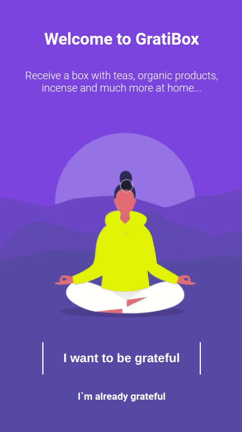

# GratiBox

Try it out now at https://grati-box-front-zeta.vercel.app/ <br>
Link to back-end: https://github.com/PMafra/Gratibox_back



## About

This project was a challenge to be developed in a maximum of 1 week. You can see about the project and the instructions for the challenge at:
https://github.com/driven-exercises/Projeto-GratiBox
(Obs.: Use your mobile for a better experience)

Below are the implemented features:

- Sign-up
- Login
- List plan signature for a user
- Add plan

## Technologies
The following tools and frameworks were used in the construction of the project:<br>
<p>
  
  
  
  
  
  
  
</p>

## How to run

1. Create a root project folder named GratiBox
```
mkdir GratiBox
```
2. Clone the front-end repo
```
git clone https://github.com/PMafra/GratiBox_front.git
```
3. Install NPM packages for the front-end repo
```
npm install
```
4. Clone the back-end repo as a sibling to the front-end (within the /GratiBox folder)
```
git clone https://github.com/PMafra/GratiBox_back.git
```
5. Install NPM packages for the back-end repo
```
npm install
```
6. Follow instructions to fully run back-end at https://github.com/PMafra/GratiBox_back

7. To run in test or development environments:
* Change API_URL variable in /src/services/Api.js from **https://gratibox-back-driven.herokuapp.com** to **http://localhost:yourBackEndPortNumber** with yourBackEndPortNumber being the PORT variable value set in your backend .env file (.env.dev or .env.test)

8. Run the front-end with
```
npm start
```
9. You can optionally build the project running (See the section about [deployment](https://facebook.github.io/create-react-app/docs/deployment) for more information)
```
npm run build
```
10. Finally access http://localhost:3000 on your favorite browser (unless it is Internet Explorer. In this case, review your life decisions :eyes:)

## Running tests with cypress

1. Change API_URL variable in /src/services/Api.js to **http://localhost:yourBackEndPortNumber** with yourBackEndPortNumber being the PORT variable value set in your backend .env.test file

2. Run the front-end with
```
npm start
```
3. Run the back-end server with
```
npx nodemon /src/server.js
```
   or:
```
npx ntl
```
* Choose 'test' option

4. Open Cypress test runner window
```
npx cypress open
```
   or: 
```
node_modules/.bin/cypress open
```
5. Finally click on "Run X integration spec" in the upper right corner to run integration tests

More information: [Follow these instructions to run the tests in CI.](https://on.cypress.io/continuous-integration)

**If you get stuck, here is more help: [Cypress Support](https://on.cypress.io/support)**


